# Database Architecture Documentation

**Project:** HVAC/R Preventive Maintenance Scheduling Application
**ORM:** Drizzle ORM
**Database:** Neon PostgreSQL (serverless)
**Schema Source:** `shared/schema.ts`
**Generated:** 2026-01-08

---

## Table of Contents

1. [Entity Relationship Diagram](#entity-relationship-diagram)
2. [Detailed Tables Reference](#detailed-tables-reference)
3. [Relationship Matrix](#relationship-matrix)
4. [Multi-Tenant Scoping](#multi-tenant-scoping)
5. [Indexes & Constraints](#indexes--constraints)
6. [Cascade Behaviors](#cascade-behaviors)

---

## Entity Relationship Diagram

```mermaid
erDiagram
    %% Root Tenant Entity
    companies ||--o{ users : "has many"
    companies ||--o{ customer_companies : "has many"
    companies ||--o{ clients : "has many"
    companies ||--o{ parts : "has many"
    companies ||--o{ client_parts : "has many"
    companies ||--o{ maintenance_records : "has many"
    companies ||--o{ calendar_assignments : "has many"
    companies ||--o{ equipment : "has many"
    companies ||--o{ company_settings : "has one"
    companies ||--o{ invitations : "has many"
    companies ||--o{ company_audit_logs : "has many"
    companies ||--o{ technicians : "has many"
    companies ||--o{ labor_entries : "has many"
    companies ||--o{ invitation_tokens : "has many"
    companies ||--o{ feedback : "has many"
    companies ||--o{ job_notes : "has many"
    companies ||--o{ client_notes : "has many"
    companies ||--o{ invoices : "has many"
    companies ||--o{ recurring_job_series : "has many"
    companies ||--o{ jobs : "has many"
    companies ||--o{ job_templates : "has many"
    companies ||--o{ tasks : "has many"
    companies ||--o{ suppliers : "has many"
    companies ||--o{ supplier_locations : "has many"
    companies ||--o| company_counters : "has one"

    %% Audit & Security
    companies ||--o{ audit_logs : "referenced in"
    users ||--o{ audit_logs : "platform admin actions"
    users ||--o{ password_reset_tokens : "has many"

    %% Customer Hierarchy
    customer_companies ||--o{ clients : "has locations"

    %% Client/Location relationships
    users ||--o{ clients : "created by"
    clients ||--o{ client_parts : "has many"
    clients ||--o{ maintenance_records : "has many"
    clients ||--o{ calendar_assignments : "has many"
    clients ||--o{ equipment : "has many"
    clients ||--o{ client_notes : "has many"
    clients ||--o{ invoices : "billed to"
    clients ||--o{ recurring_job_series : "scheduled at"
    clients ||--o{ jobs : "performed at"
    clients ||--o{ location_pm_plans : "has one"
    clients ||--o{ location_equipment : "has equipment"
    clients ||--o{ location_pm_part_templates : "has templates"
    clients ||--o{ tasks : "associated with"

    %% Parts/Inventory
    users ||--o{ parts : "created by"
    parts ||--o{ client_parts : "used at"
    parts ||--o{ location_pm_part_templates : "used in templates"
    parts ||--o{ job_parts : "used in jobs"
    parts ||--o{ job_template_line_items : "used in templates"

    %% Equipment
    location_equipment ||--o{ location_pm_part_templates : "has parts"
    location_equipment ||--o{ job_parts : "parts linked to"
    location_equipment ||--o{ job_equipment : "worked on in jobs"

    %% Calendar & Scheduling
    users ||--o{ calendar_assignments : "assigned to"
    calendar_assignments ||--o{ job_notes : "has notes"

    %% Invoicing & Billing
    invoices ||--o{ invoice_lines : "has lines"
    invoices ||--o{ payments : "has payments"
    customer_companies ||--o{ invoices : "billed to (optional)"
    jobs ||--o| invoices : "generates"

    %% Jobs System
    users ||--o{ jobs : "primary technician"
    jobs ||--o{ job_parts : "has parts"
    jobs ||--o{ job_equipment : "equipment worked on"
    jobs ||--o{ labor_entries : "has labor"
    jobs ||--o{ tasks : "associated with"
    calendar_assignments ||--o| jobs : "linked to"

    %% Recurring Jobs
    users ||--o{ recurring_job_series : "created by"
    recurring_job_series ||--o{ recurring_job_phases : "has phases"
    recurring_job_series ||--o{ jobs : "generates"
    recurring_job_series ||--o{ location_pm_plans : "linked to"

    %% PM Planning
    location_pm_plans ||--o{ location_pm_part_templates : "defines parts"

    %% Job Templates
    job_templates ||--o{ job_template_line_items : "has lines"

    %% Technicians & Labor
    users ||--o{ technicians : "linked to"
    technicians ||--o{ labor_entries : "performed work"
    users ||--o| technician_profiles : "has profile"
    users ||--o{ working_hours : "has schedule"

    %% Invitations
    users ||--o{ invitations : "invited"
    users ||--o{ invitation_tokens : "created by"
    users ||--o{ invitation_tokens : "used by"

    %% Roles & Permissions (RBAC)
    users ||--o| roles : "has role"
    roles ||--o{ role_permissions : "has permissions"
    permissions ||--o{ role_permissions : "granted to roles"
    users ||--o{ user_permission_overrides : "has overrides"
    permissions ||--o{ user_permission_overrides : "overridden for user"

    %% Tasks & Suppliers
    users ||--o{ tasks : "created by"
    users ||--o{ tasks : "assigned to"
    users ||--o{ tasks : "closed by"
    tasks ||--o| supplier_visit_details : "has visit details"
    suppliers ||--o{ supplier_locations : "has locations"
    suppliers ||--o{ supplier_visit_details : "visited"
    supplier_locations ||--o{ supplier_visit_details : "visit location"

    %% Notes
    users ||--o{ job_notes : "created by"
    users ||--o{ client_notes : "created by"
    users ||--o{ feedback : "submitted by"
    users ||--o{ company_audit_logs : "performed action"
    users ||--o{ maintenance_records : "created by"
```

---

## Detailed Tables Reference

### 1. **companies** (Tenant Root)
Primary tenant entity - each HVAC business is a company.

| Column | Type | Nullable | Default | Description |
|--------|------|----------|---------|-------------|
| id | varchar | NO | gen_random_uuid() | Primary key |
| name | text | NO | - | Company name |
| address | text | YES | - | Street address |
| city | text | YES | - | City |
| provinceState | text | YES | - | Province/State |
| postalCode | text | YES | - | Postal/ZIP code |
| email | text | YES | - | Company email |
| phone | text | YES | - | Company phone |
| trialEndsAt | timestamp | YES | - | Trial expiration date |
| subscriptionStatus | text | NO | 'trial' | Subscription status |
| subscriptionPlan | text | YES | - | Active plan name |
| billingInterval | text | YES | - | monthly/yearly |
| currentPeriodEnd | timestamp | YES | - | Subscription period end |
| cancelAtPeriodEnd | boolean | NO | false | Cancel flag |
| stripeCustomerId | text | YES | - | Stripe customer ID |
| stripeSubscriptionId | text | YES | - | Stripe subscription ID |
| taxName | text | NO | 'HST' | Tax name (HST/GST/VAT) |
| defaultTaxRate | numeric(5,2) | NO | 13.00 | Default tax rate % |
| createdAt | timestamp | NO | CURRENT_TIMESTAMP | Creation timestamp |

**Primary Key:** id
**Foreign Keys:** None (root entity)
**Unique Constraints:** None
**Indexes:** Primary key index

---

### 2. **users**
User accounts scoped to companies.

| Column | Type | Nullable | Default | Description |
|--------|------|----------|---------|-------------|
| id | varchar | NO | gen_random_uuid() | Primary key |
| companyId | varchar | NO | - | Foreign key to companies |
| email | text | NO | - | User email (unique) |
| password | text | NO | - | Hashed password |
| role | text | NO | 'technician' | Legacy role field |
| roleId | varchar | YES | - | FK to roles table |
| fullName | text | YES | - | Full name |
| firstName | text | YES | - | First name |
| lastName | text | YES | - | Last name |
| phone | text | YES | - | Phone number |
| status | text | NO | 'active' | active/invited/deactivated |
| disabled | boolean | NO | false | Account disabled flag |
| useCustomSchedule | boolean | NO | false | Custom vs company schedule |
| lastLoginAt | timestamp | YES | - | Last login timestamp |
| createdAt | timestamp | NO | CURRENT_TIMESTAMP | Creation timestamp |

**Primary Key:** id
**Foreign Keys:**
- companyId → companies.id (CASCADE)
- roleId → roles.id (no explicit cascade)

**Unique Constraints:** email
**Indexes:** Primary key, email unique index

---

### 3. **password_reset_tokens**
Password reset token management.

| Column | Type | Nullable | Default | Description |
|--------|------|----------|---------|-------------|
| id | varchar | NO | gen_random_uuid() | Primary key |
| userId | varchar | NO | - | FK to users |
| tokenHash | text | NO | - | Hashed token (unique) |
| expiresAt | timestamp | NO | - | Expiration timestamp |
| usedAt | timestamp | YES | - | Usage timestamp |
| createdAt | timestamp | NO | CURRENT_TIMESTAMP | Creation timestamp |
| requestedIp | text | YES | - | Request IP address |

**Primary Key:** id
**Foreign Keys:**
- userId → users.id (CASCADE)

**Unique Constraints:** tokenHash
**Indexes:** Primary key, tokenHash unique index

---

### 4. **audit_logs**
Platform admin impersonation and cross-tenant action audit trail.

| Column | Type | Nullable | Default | Description |
|--------|------|----------|---------|-------------|
| id | varchar | NO | gen_random_uuid() | Primary key |
| platformAdminId | varchar | NO | - | FK to platform admin user |
| platformAdminEmail | text | NO | - | Admin email (denormalized) |
| targetCompanyId | varchar | YES | - | Target company (nullable) |
| targetUserId | varchar | YES | - | Target user (nullable) |
| action | text | NO | - | Action type |
| reason | text | YES | - | Action reason |
| details | text | YES | - | JSON details |
| ipAddress | text | YES | - | Request IP |
| userAgent | text | YES | - | User agent string |
| createdAt | timestamp | NO | CURRENT_TIMESTAMP | Action timestamp |

**Primary Key:** id
**Foreign Keys:**
- platformAdminId → users.id (CASCADE)
- targetCompanyId → companies.id (SET NULL)
- targetUserId → users.id (SET NULL)

**Unique Constraints:** None
**Indexes:** Primary key

---

### 5. **customer_companies**
Parent corporate entities that map to QBO Customers.

| Column | Type | Nullable | Default | Description |
|--------|------|----------|---------|-------------|
| id | varchar | NO | gen_random_uuid() | Primary key |
| companyId | varchar | NO | - | FK to tenant company |
| name | text | NO | - | Customer company name |
| legalName | text | YES | - | Legal entity name |
| phone | text | YES | - | Phone number |
| email | text | YES | - | Email address |
| billingStreet | text | YES | - | Billing street address |
| billingCity | text | YES | - | Billing city |
| billingProvince | text | YES | - | Billing province/state |
| billingPostalCode | text | YES | - | Billing postal code |
| billingCountry | text | YES | - | Billing country |
| isActive | boolean | NO | true | Active status |
| qboCustomerId | text | YES | - | QBO Customer.Id |
| qboSyncToken | text | YES | - | QBO SyncToken |
| qboLastSyncedAt | timestamp | YES | - | Last QBO sync |
| createdAt | timestamp | NO | CURRENT_TIMESTAMP | Creation timestamp |
| updatedAt | timestamp | YES | - | Update timestamp |

**Primary Key:** id
**Foreign Keys:**
- companyId → companies.id (CASCADE)

**Unique Constraints:** None
**Indexes:** Primary key

---

### 6. **client_locations** (formerly `clients`)
Service locations (map to QBO Sub-Customers). Can have optional parent company.

| Column | Type | Nullable | Default | Description |
|--------|------|----------|---------|-------------|
| id | varchar | NO | gen_random_uuid() | Primary key |
| companyId | varchar | NO | - | FK to tenant company |
| userId | varchar | NO | - | Created by user |
| parentCompanyId | varchar | YES | - | FK to customer_companies |
| companyName | text | NO | - | Client/location name |
| location | text | YES | - | Site name |
| address | text | YES | - | Service address |
| city | text | YES | - | City |
| province | text | YES | - | Province/state |
| postalCode | text | YES | - | Postal code |
| contactName | text | YES | - | Contact person |
| email | text | YES | - | Contact email |
| phone | text | YES | - | Contact phone |
| roofLadderCode | text | YES | - | Access code |
| notes | text | YES | - | General notes |
| selectedMonths | integer[] | NO | - | PM months (1-12) |
| inactive | boolean | NO | false | Inactive flag |
| nextDue | text | NO | - | Next PM due date |
| isPrimary | boolean | NO | false | Primary location flag |
| needsDetails | boolean | NO | false | Quick-create flag |
| billWithParent | boolean | NO | true | Bill to parent company |
| qboCustomerId | text | YES | - | QBO Sub-Customer.Id |
| qboParentCustomerId | text | YES | - | QBO parent reference |
| qboSyncToken | text | YES | - | QBO SyncToken |
| qboLastSyncedAt | timestamp | YES | - | Last QBO sync |
| version | integer | NO | 0 | Optimistic lock version |
| createdAt | timestamp | NO | CURRENT_TIMESTAMP | Creation timestamp |

**Primary Key:** id
**Foreign Keys:**
- companyId → companies.id (CASCADE)
- userId → users.id (CASCADE)
- parentCompanyId → customer_companies.id (SET NULL)

**Unique Constraints:** None
**Indexes:** Primary key

---

### 7. **parts**
Items/products/services (filters, belts, services). Designed for future QBO Item sync.

| Column | Type | Nullable | Default | Description |
|--------|------|----------|---------|-------------|
| id | varchar | NO | gen_random_uuid() | Primary key |
| companyId | varchar | NO | - | FK to tenant company |
| userId | varchar | NO | - | Created by user |
| type | text | NO | - | filter/belt/other/service/product |
| filterType | text | YES | - | Pleated/Media/Ecology/etc |
| beltType | text | YES | - | A/B/Other |
| size | text | YES | - | Item size |
| name | text | YES | - | Item name |
| sku | text | YES | - | SKU/item code |
| description | text | YES | - | Item description |
| cost | numeric(12,2) | YES | - | Cost price |
| markupPercent | numeric(5,2) | YES | - | Markup percentage |
| unitPrice | numeric(12,2) | YES | - | Selling price |
| isTaxable | boolean | YES | true | Taxable flag |
| taxExempt | boolean | YES | false | Legacy tax exempt flag |
| taxCode | text | YES | - | Tax code reference |
| category | text | YES | - | Item category |
| isActive | boolean | YES | true | Active status |
| qboItemId | text | YES | - | QBO Item.Id |
| qboSyncToken | text | YES | - | QBO SyncToken |
| createdAt | timestamp | NO | CURRENT_TIMESTAMP | Creation timestamp |
| updatedAt | timestamp | YES | - | Update timestamp |

**Primary Key:** id
**Foreign Keys:**
- companyId → companies.id (CASCADE)
- userId → users.id (CASCADE)

**Unique Constraints:** None
**Indexes:** Primary key

---

### 8. **client_parts**
Junction table - parts inventory at client locations (legacy).

| Column | Type | Nullable | Default | Description |
|--------|------|----------|---------|-------------|
| id | varchar | NO | gen_random_uuid() | Primary key |
| companyId | varchar | NO | - | FK to tenant company |
| userId | varchar | NO | - | Created by user |
| clientId | varchar | NO | - | FK to clients |
| partId | varchar | NO | - | FK to parts |
| quantity | integer | NO | - | Quantity on hand |

**Primary Key:** id
**Foreign Keys:**
- companyId → companies.id (CASCADE)
- userId → users.id (CASCADE)
- clientId → clients.id (CASCADE)
- partId → parts.id (CASCADE)

**Unique Constraints:** None
**Indexes:** Primary key

---

### 9. **maintenance_records**
PM completion records (legacy).

| Column | Type | Nullable | Default | Description |
|--------|------|----------|---------|-------------|
| id | varchar | NO | gen_random_uuid() | Primary key |
| companyId | varchar | NO | - | FK to tenant company |
| userId | varchar | NO | - | Created by user |
| clientId | varchar | NO | - | FK to clients |
| dueDate | date | NO | - | Due date |
| completedAt | timestamp | YES | - | Completion timestamp |

**Primary Key:** id
**Foreign Keys:**
- companyId → companies.id (CASCADE)
- userId → users.id (CASCADE)
- clientId → clients.id (CASCADE)

**Unique Constraints:** None
**Indexes:** Primary key

---

### 10. **calendar_assignments**
Calendar scheduling for PM jobs (legacy, being migrated to jobs table).

| Column | Type | Nullable | Default | Description |
|--------|------|----------|---------|-------------|
| id | varchar | NO | gen_random_uuid() | Primary key |
| companyId | varchar | NO | - | FK to tenant company |
| userId | varchar | NO | - | Created by user |
| clientId | varchar | NO | - | FK to clients |
| jobNumber | integer | NO | - | Job number |
| assignedTechnicianIds | varchar[] | YES | - | Assigned technician IDs |
| year | integer | NO | - | Scheduled year |
| month | integer | NO | - | Scheduled month (1-12) |
| day | integer | YES | - | Scheduled day |
| scheduledDate | date | NO | - | Full scheduled date |
| scheduledHour | integer | YES | - | Scheduled hour (0-23) |
| scheduledStartMinutes | integer | YES | - | Start time in minutes |
| durationMinutes | integer | YES | 60 | Duration in minutes |
| autoDueDate | boolean | NO | true | Auto-calculate due date |
| completed | boolean | NO | false | Completion flag |
| completionNotes | text | YES | - | Completion notes |

**Primary Key:** id
**Foreign Keys:**
- companyId → companies.id (CASCADE)
- userId → users.id (CASCADE)
- clientId → clients.id (CASCADE)

**Unique Constraints:** None
**Indexes:** Primary key

---

### 11. **company_counters**
Sequential counters per company (job numbers, invoice numbers).

| Column | Type | Nullable | Default | Description |
|--------|------|----------|---------|-------------|
| id | varchar | NO | gen_random_uuid() | Primary key |
| companyId | varchar | NO | - | FK to tenant company (unique) |
| nextJobNumber | integer | NO | 10000 | Next job number |
| nextInvoiceNumber | integer | NO | 1001 | Next invoice number |

**Primary Key:** id
**Foreign Keys:**
- companyId → companies.id (CASCADE)

**Unique Constraints:** companyId
**Indexes:** Primary key, companyId unique index

---

### 12. **equipment** (LEGACY - use location_equipment instead)
Equipment tracking per client location.

| Column | Type | Nullable | Default | Description |
|--------|------|----------|---------|-------------|
| id | varchar | NO | gen_random_uuid() | Primary key |
| companyId | varchar | NO | - | FK to tenant company |
| userId | varchar | NO | - | Created by user |
| clientId | varchar | NO | - | FK to clients |
| name | text | NO | - | Equipment name |
| type | text | YES | - | Equipment type |
| modelNumber | text | YES | - | Model number |
| serialNumber | text | YES | - | Serial number |
| location | text | YES | - | Location within site |
| notes | text | YES | - | General notes |
| createdAt | timestamp | NO | CURRENT_TIMESTAMP | Creation timestamp |

**Primary Key:** id
**Foreign Keys:**
- companyId → companies.id (CASCADE)
- userId → users.id (CASCADE)
- clientId → clients.id (CASCADE)

**Unique Constraints:** None
**Indexes:** Primary key

---

### 13. **company_settings**
Company-level settings (calendar start hour, contact info).

| Column | Type | Nullable | Default | Description |
|--------|------|----------|---------|-------------|
| id | varchar | NO | gen_random_uuid() | Primary key |
| companyId | varchar | NO | - | FK to tenant company (unique) |
| userId | varchar | NO | - | FK to user (unique) |
| companyName | text | YES | - | Company name override |
| address | text | YES | - | Company address |
| city | text | YES | - | City |
| provinceState | text | YES | - | Province/state |
| postalCode | text | YES | - | Postal code |
| email | text | YES | - | Company email |
| phone | text | YES | - | Company phone |
| calendarStartHour | integer | NO | 8 | Calendar start hour |
| updatedAt | text | NO | CURRENT_TIMESTAMP | Update timestamp |

**Primary Key:** id
**Foreign Keys:**
- companyId → companies.id (CASCADE)
- userId → users.id (CASCADE)

**Unique Constraints:** companyId, userId
**Indexes:** Primary key, unique constraints

---

### 14. **invitations**
User invitations to join company.

| Column | Type | Nullable | Default | Description |
|--------|------|----------|---------|-------------|
| id | varchar | NO | gen_random_uuid() | Primary key |
| companyId | varchar | NO | - | FK to tenant company |
| email | text | NO | - | Invited email |
| role | text | NO | - | Assigned role |
| token | text | NO | - | Invitation token (unique) |
| status | text | NO | 'pending' | pending/accepted/expired/revoked |
| expiresAt | timestamp | NO | - | Expiration timestamp |
| acceptedAt | timestamp | YES | - | Acceptance timestamp |
| createdAt | timestamp | NO | CURRENT_TIMESTAMP | Creation timestamp |
| updatedAt | timestamp | YES | - | Update timestamp |

**Primary Key:** id
**Foreign Keys:**
- companyId → companies.id (CASCADE)

**Unique Constraints:** token
**Indexes:** Primary key, token unique index

---

### 15. **company_audit_logs**
Tenant-scoped operational audit trail.

| Column | Type | Nullable | Default | Description |
|--------|------|----------|---------|-------------|
| id | varchar | NO | gen_random_uuid() | Primary key |
| companyId | varchar | NO | - | FK to tenant company |
| userId | varchar | YES | - | User who performed action |
| action | text | NO | - | Action type |
| entity | text | NO | - | Entity type |
| entityId | varchar | YES | - | Entity ID |
| metadata | text | YES | - | JSON metadata |
| createdAt | timestamp | NO | CURRENT_TIMESTAMP | Action timestamp |

**Primary Key:** id
**Foreign Keys:**
- companyId → companies.id (CASCADE)
- userId → users.id (SET NULL)

**Unique Constraints:** None
**Indexes:** Primary key

---

### 16. **technicians**
Technician operational entities (may link to user accounts).

| Column | Type | Nullable | Default | Description |
|--------|------|----------|---------|-------------|
| id | varchar | NO | gen_random_uuid() | Primary key |
| companyId | varchar | NO | - | FK to tenant company |
| name | text | NO | - | Technician name |
| userId | varchar | YES | - | Linked user account |
| isActive | boolean | NO | true | Active status |
| createdAt | timestamp | NO | CURRENT_TIMESTAMP | Creation timestamp |
| updatedAt | timestamp | YES | - | Update timestamp |

**Primary Key:** id
**Foreign Keys:**
- companyId → companies.id (CASCADE)
- userId → users.id (SET NULL)

**Unique Constraints:** None
**Indexes:** Primary key

---

### 17. **labor_entries**
Immutable time records for technician labor on jobs.

| Column | Type | Nullable | Default | Description |
|--------|------|----------|---------|-------------|
| id | varchar | NO | gen_random_uuid() | Primary key |
| companyId | varchar | NO | - | FK to tenant company |
| technicianId | varchar | NO | - | FK to technicians |
| jobId | varchar | NO | - | FK to jobs |
| minutes | integer | NO | - | Labor time in minutes |
| note | text | YES | - | Labor note |
| createdAt | timestamp | NO | CURRENT_TIMESTAMP | Creation timestamp |

**Primary Key:** id
**Foreign Keys:**
- companyId → companies.id (CASCADE)
- technicianId → technicians.id (CASCADE)
- jobId → jobs.id (CASCADE)

**Unique Constraints:** None
**Indexes:** Primary key

---

### 18. **invitation_tokens**
Technician onboarding invitation tokens.

| Column | Type | Nullable | Default | Description |
|--------|------|----------|---------|-------------|
| id | varchar | NO | gen_random_uuid() | Primary key |
| companyId | varchar | NO | - | FK to tenant company |
| createdByUserId | varchar | NO | - | Creator user ID |
| token | text | NO | - | Token (unique) |
| email | text | YES | - | Invited email |
| role | text | NO | 'technician' | Assigned role |
| expiresAt | timestamp | NO | - | Expiration timestamp |
| usedAt | timestamp | YES | - | Usage timestamp |
| usedByUserId | varchar | YES | - | User who used token |
| createdAt | timestamp | NO | CURRENT_TIMESTAMP | Creation timestamp |

**Primary Key:** id
**Foreign Keys:**
- companyId → companies.id (CASCADE)
- createdByUserId → users.id (CASCADE)
- usedByUserId → users.id (SET NULL)

**Unique Constraints:** token
**Indexes:** Primary key, token unique index

---

### 19. **feedback**
User feedback submissions.

| Column | Type | Nullable | Default | Description |
|--------|------|----------|---------|-------------|
| id | varchar | NO | gen_random_uuid() | Primary key |
| companyId | varchar | NO | - | FK to tenant company |
| userId | varchar | NO | - | Submitter user ID |
| userEmail | text | NO | - | Submitter email |
| category | text | NO | - | Feedback category |
| message | text | NO | - | Feedback message |
| createdAt | timestamp | NO | CURRENT_TIMESTAMP | Submission timestamp |
| status | text | NO | 'new' | Processing status |
| archived | boolean | NO | false | Archive flag |

**Primary Key:** id
**Foreign Keys:**
- companyId → companies.id (CASCADE)
- userId → users.id (CASCADE)

**Unique Constraints:** None
**Indexes:** Primary key

---

### 20. **subscription_plans**
Available subscription plans (global, not tenant-scoped).

| Column | Type | Nullable | Default | Description |
|--------|------|----------|---------|-------------|
| id | varchar | NO | gen_random_uuid() | Primary key |
| name | text | NO | - | Plan name (unique) |
| displayName | text | NO | - | Display name |
| stripePriceId | text | YES | - | Stripe price ID |
| monthlyPriceCents | integer | YES | - | Price in cents |
| locationLimit | integer | NO | - | Max locations allowed |
| isTrial | boolean | NO | false | Trial plan flag |
| trialDays | integer | YES | - | Trial duration |
| sortOrder | integer | NO | 0 | Display sort order |
| active | boolean | NO | true | Active status |
| createdAt | timestamp | NO | CURRENT_TIMESTAMP | Creation timestamp |
| updatedAt | timestamp | NO | CURRENT_TIMESTAMP | Update timestamp |

**Primary Key:** id
**Foreign Keys:** None (global table)
**Unique Constraints:** name
**Indexes:** Primary key, name unique index

---

### 21. **job_notes**
Timestamped notes for calendar assignments/jobs.

| Column | Type | Nullable | Default | Description |
|--------|------|----------|---------|-------------|
| id | varchar | NO | gen_random_uuid() | Primary key |
| companyId | varchar | NO | - | FK to tenant company |
| assignmentId | varchar | NO | - | FK to calendar_assignments |
| userId | varchar | NO | - | Note author |
| noteText | text | NO | - | Note content |
| imageUrl | text | YES | - | Optional image URL |
| createdAt | timestamp | NO | CURRENT_TIMESTAMP | Creation timestamp |
| updatedAt | timestamp | NO | CURRENT_TIMESTAMP | Update timestamp |

**Primary Key:** id
**Foreign Keys:**
- companyId → companies.id (CASCADE)
- assignmentId → calendar_assignments.id (CASCADE)
- userId → users.id (CASCADE)

**Unique Constraints:** None
**Indexes:** Primary key

---

### 22. **client_notes**
Timestamped notes for clients.

| Column | Type | Nullable | Default | Description |
|--------|------|----------|---------|-------------|
| id | varchar | NO | gen_random_uuid() | Primary key |
| companyId | varchar | NO | - | FK to tenant company |
| clientId | varchar | NO | - | FK to clients |
| userId | varchar | NO | - | Note author |
| noteText | text | NO | - | Note content |
| createdAt | timestamp | NO | CURRENT_TIMESTAMP | Creation timestamp |
| updatedAt | timestamp | NO | CURRENT_TIMESTAMP | Update timestamp |

**Primary Key:** id
**Foreign Keys:**
- companyId → companies.id (CASCADE)
- clientId → clients.id (CASCADE)
- userId → users.id (CASCADE)

**Unique Constraints:** None
**Indexes:** Primary key

---

### 23. **invoices**
Invoices for billing (syncs with QBO).

| Column | Type | Nullable | Default | Description |
|--------|------|----------|---------|-------------|
| id | varchar | NO | gen_random_uuid() | Primary key |
| companyId | varchar | NO | - | FK to tenant company |
| locationId | varchar | NO | - | FK to clients (location) |
| customerCompanyId | varchar | YES | - | FK to customer_companies |
| invoiceNumber | text | YES | - | Invoice number |
| status | text | NO | 'draft' | draft/sent/paid/void/cancelled |
| issueDate | date | NO | - | Issue date |
| dueDate | date | YES | - | Due date |
| currency | text | NO | 'CAD' | Currency code |
| subtotal | numeric(12,2) | NO | 0.00 | Subtotal amount |
| taxTotal | numeric(12,2) | NO | 0.00 | Tax amount |
| total | numeric(12,2) | NO | 0.00 | Total amount |
| amountPaid | numeric(12,2) | NO | 0.00 | Amount paid |
| balance | numeric(12,2) | NO | 0.00 | Balance due |
| jobId | varchar | YES | - | Related job ID |
| sentAt | timestamp | YES | - | Sent timestamp |
| viewedAt | timestamp | YES | - | Viewed timestamp |
| notesInternal | text | YES | - | Internal notes |
| notesCustomer | text | YES | - | Customer notes |
| workDescription | text | YES | - | Work description |
| clientMessage | text | YES | - | Client message |
| showQuantity | boolean | NO | true | Show quantity on invoice |
| showUnitPrice | boolean | NO | true | Show unit price |
| showLineTotals | boolean | NO | true | Show line totals |
| showLineItems | boolean | NO | true | Show line items |
| showBalance | boolean | NO | true | Show balance |
| qboInvoiceId | text | YES | - | QBO Invoice.Id |
| qboSyncToken | text | YES | - | QBO SyncToken |
| qboLastSyncedAt | timestamp | YES | - | Last QBO sync |
| qboDocNumber | text | YES | - | QBO DocNumber |
| dirty | boolean | NO | false | Modified since sync |
| isActive | boolean | NO | true | Active status |
| version | integer | NO | 0 | Optimistic lock version |
| createdAt | timestamp | NO | CURRENT_TIMESTAMP | Creation timestamp |
| updatedAt | timestamp | YES | - | Update timestamp |

**Primary Key:** id
**Foreign Keys:**
- companyId → companies.id (CASCADE)
- locationId → clients.id (CASCADE)
- customerCompanyId → customer_companies.id (SET NULL)

**Unique Constraints:**
- (companyId, jobId) where jobId is not null
- (companyId, invoiceNumber) where invoiceNumber is not null

**Indexes:** Primary key, unique constraints

---

### 24. **invoice_lines**
Line items for invoices.

| Column | Type | Nullable | Default | Description |
|--------|------|----------|---------|-------------|
| id | varchar | NO | gen_random_uuid() | Primary key |
| invoiceId | varchar | NO | - | FK to invoices |
| lineNumber | integer | NO | - | Line ordering |
| lineItemType | text | NO | 'service' | service/material/fee/discount |
| description | text | NO | - | Line description |
| date | date | YES | - | Line date |
| technicianId | varchar | YES | - | Technician reference |
| quantity | text | NO | '1' | Quantity (decimal as text) |
| unitCost | numeric(12,2) | YES | - | Unit cost |
| unitPrice | numeric(12,2) | NO | 0.00 | Unit price |
| taxRate | numeric(5,4) | NO | 0.0000 | Tax rate as decimal |
| lineSubtotal | numeric(12,2) | NO | 0.00 | Subtotal |
| taxAmount | numeric(12,2) | NO | 0.00 | Tax amount |
| lineTotal | numeric(12,2) | NO | 0.00 | Total |
| taxCode | text | YES | - | Tax code |
| jobLineItemId | varchar | YES | - | Source job line item |
| qboItemRefId | text | YES | - | QBO ItemRef |
| qboTaxCodeRefId | text | YES | - | QBO TaxCodeRef |
| metadata | text | YES | - | JSON metadata |
| source | text | NO | 'manual' | manual/job |
| createdAt | timestamp | NO | CURRENT_TIMESTAMP | Creation timestamp |
| updatedAt | timestamp | YES | - | Update timestamp |

**Primary Key:** id
**Foreign Keys:**
- invoiceId → invoices.id (CASCADE)

**Unique Constraints:** None
**Indexes:** Primary key

---

### 25. **payments**
Payment records against invoices.

| Column | Type | Nullable | Default | Description |
|--------|------|----------|---------|-------------|
| id | varchar | NO | gen_random_uuid() | Primary key |
| invoiceId | varchar | NO | - | FK to invoices |
| amount | numeric(12,2) | NO | - | Payment amount |
| method | text | NO | 'other' | Payment method |
| reference | text | YES | - | Transaction reference |
| receivedAt | timestamp | NO | CURRENT_TIMESTAMP | Received timestamp |
| notes | text | YES | - | Payment notes |
| createdAt | timestamp | NO | CURRENT_TIMESTAMP | Creation timestamp |

**Primary Key:** id
**Foreign Keys:**
- invoiceId → invoices.id (CASCADE)

**Unique Constraints:** None
**Indexes:** Primary key

---

### 26. **recurring_job_series**
Recurring job templates.

| Column | Type | Nullable | Default | Description |
|--------|------|----------|---------|-------------|
| id | varchar | NO | gen_random_uuid() | Primary key |
| companyId | varchar | NO | - | FK to tenant company |
| locationId | varchar | NO | - | FK to clients |
| baseSummary | text | NO | - | Job summary template |
| baseDescription | text | YES | - | Job description template |
| baseJobType | text | NO | 'service' | Job type |
| basePriority | text | NO | 'normal' | Priority |
| defaultTechnicianId | varchar | YES | - | Default technician |
| startDate | date | NO | - | Series start date |
| timezone | text | YES | 'America/Toronto' | Timezone |
| notes | text | YES | - | Series notes |
| isActive | boolean | NO | true | Active status |
| createdByUserId | varchar | YES | - | Creator user ID |
| createdAt | timestamp | NO | CURRENT_TIMESTAMP | Creation timestamp |
| updatedAt | timestamp | YES | - | Update timestamp |

**Primary Key:** id
**Foreign Keys:**
- companyId → companies.id (CASCADE)
- locationId → clients.id (CASCADE)
- defaultTechnicianId → users.id (SET NULL)
- createdByUserId → users.id (SET NULL)

**Unique Constraints:** None
**Indexes:** Primary key

---

### 27. **recurring_job_phases**
Recurrence patterns for job series.

| Column | Type | Nullable | Default | Description |
|--------|------|----------|---------|-------------|
| id | varchar | NO | gen_random_uuid() | Primary key |
| seriesId | varchar | NO | - | FK to recurring_job_series |
| orderIndex | integer | NO | 0 | Phase order |
| frequency | text | NO | - | daily/weekly/monthly/quarterly/yearly |
| interval | integer | NO | 1 | Recurrence interval |
| occurrences | integer | YES | - | Max occurrences |
| untilDate | date | YES | - | End date |

**Primary Key:** id
**Foreign Keys:**
- seriesId → recurring_job_series.id (CASCADE)

**Unique Constraints:** None
**Indexes:** Primary key

---

### 28. **jobs**
Individual job instances.

| Column | Type | Nullable | Default | Description |
|--------|------|----------|---------|-------------|
| id | varchar | NO | gen_random_uuid() | Primary key |
| companyId | varchar | NO | - | FK to tenant company |
| locationId | varchar | NO | - | FK to clients |
| jobNumber | integer | NO | - | Job number (unique per company) |
| primaryTechnicianId | varchar | YES | - | Primary technician |
| assignedTechnicianIds | varchar[] | YES | - | Assigned technicians |
| status | text | NO | 'draft' | Job status |
| priority | text | NO | 'medium' | Priority level |
| jobType | text | NO | 'maintenance' | Job type |
| summary | text | NO | - | Job summary |
| description | text | YES | - | Job description |
| accessInstructions | text | YES | - | Access instructions |
| scheduledStart | timestamp | YES | - | Scheduled start |
| scheduledEnd | timestamp | YES | - | Scheduled end |
| actualStart | timestamp | YES | - | Actual start |
| actualEnd | timestamp | YES | - | Actual end |
| invoiceId | varchar | YES | - | Related invoice |
| qboInvoiceId | text | YES | - | QBO invoice ID |
| billingNotes | text | YES | - | Billing notes |
| recurringSeriesId | varchar | YES | - | Recurring series link |
| calendarAssignmentId | varchar | YES | - | Legacy calendar link |
| isActive | boolean | NO | true | Active status |
| version | integer | NO | 0 | Optimistic lock version |
| createdAt | timestamp | NO | CURRENT_TIMESTAMP | Creation timestamp |
| updatedAt | timestamp | YES | - | Update timestamp |

**Primary Key:** id
**Foreign Keys:**
- companyId → companies.id (CASCADE)
- locationId → clients.id (CASCADE)
- primaryTechnicianId → users.id (SET NULL)
- invoiceId → invoices.id (SET NULL)
- recurringSeriesId → recurring_job_series.id (SET NULL)
- calendarAssignmentId → calendar_assignments.id (SET NULL)

**Unique Constraints:** (companyId, jobNumber)
**Indexes:** Primary key, unique constraint on (companyId, jobNumber)

---

### 29. **location_pm_plans**
PM schedules per location.

| Column | Type | Nullable | Default | Description |
|--------|------|----------|---------|-------------|
| id | varchar | NO | gen_random_uuid() | Primary key |
| locationId | varchar | NO | - | FK to clients |
| hasPm | boolean | NO | false | Has PM service |
| pmType | text | YES | - | PM type description |
| pmJan | boolean | NO | false | PM in January |
| pmFeb | boolean | NO | false | PM in February |
| pmMar | boolean | NO | false | PM in March |
| pmApr | boolean | NO | false | PM in April |
| pmMay | boolean | NO | false | PM in May |
| pmJun | boolean | NO | false | PM in June |
| pmJul | boolean | NO | false | PM in July |
| pmAug | boolean | NO | false | PM in August |
| pmSep | boolean | NO | false | PM in September |
| pmOct | boolean | NO | false | PM in October |
| pmNov | boolean | NO | false | PM in November |
| pmDec | boolean | NO | false | PM in December |
| notes | text | YES | - | Plan notes |
| recurringSeriesId | varchar | YES | - | Linked recurring series |
| isActive | boolean | NO | true | Active status |
| createdAt | timestamp | NO | CURRENT_TIMESTAMP | Creation timestamp |
| updatedAt | timestamp | YES | - | Update timestamp |

**Primary Key:** id
**Foreign Keys:**
- locationId → clients.id (CASCADE)
- recurringSeriesId → recurring_job_series.id (SET NULL)

**Unique Constraints:** None
**Indexes:** Primary key

---

### 30. **location_equipment**
Equipment at client locations.

| Column | Type | Nullable | Default | Description |
|--------|------|----------|---------|-------------|
| id | varchar | NO | gen_random_uuid() | Primary key |
| locationId | varchar | NO | - | FK to clients |
| name | text | NO | - | Equipment name |
| equipmentType | text | YES | - | Equipment type |
| manufacturer | text | YES | - | Manufacturer |
| modelNumber | text | YES | - | Model number |
| serialNumber | text | YES | - | Serial number |
| tagNumber | text | YES | - | Asset tag |
| installDate | date | YES | - | Install date |
| warrantyExpiry | date | YES | - | Warranty expiry |
| notes | text | YES | - | Equipment notes |
| isActive | boolean | NO | true | Active status |
| createdAt | timestamp | NO | CURRENT_TIMESTAMP | Creation timestamp |
| updatedAt | timestamp | YES | - | Update timestamp |

**Primary Key:** id
**Foreign Keys:**
- locationId → clients.id (CASCADE)

**Unique Constraints:** None
**Indexes:** Primary key

---

### 31. **location_pm_part_templates**
PM part templates per location.

| Column | Type | Nullable | Default | Description |
|--------|------|----------|---------|-------------|
| id | varchar | NO | gen_random_uuid() | Primary key |
| locationId | varchar | NO | - | FK to clients |
| productId | varchar | NO | - | FK to parts |
| equipmentId | varchar | YES | - | FK to location_equipment |
| descriptionOverride | text | YES | - | Custom description |
| quantityPerVisit | text | NO | - | Quantity (decimal as text) |
| equipmentLabel | text | YES | - | Legacy equipment label |
| isActive | boolean | NO | true | Active status |
| createdAt | timestamp | NO | CURRENT_TIMESTAMP | Creation timestamp |
| updatedAt | timestamp | YES | - | Update timestamp |

**Primary Key:** id
**Foreign Keys:**
- locationId → clients.id (CASCADE)
- productId → parts.id (CASCADE)
- equipmentId → location_equipment.id (SET NULL)

**Unique Constraints:** None
**Indexes:** Primary key

---

### 32. **job_parts**
Parts attached to jobs.

| Column | Type | Nullable | Default | Description |
|--------|------|----------|---------|-------------|
| id | varchar | NO | gen_random_uuid() | Primary key |
| jobId | varchar | NO | - | FK to jobs |
| productId | varchar | YES | - | FK to parts |
| equipmentId | varchar | YES | - | FK to location_equipment |
| description | text | NO | - | Part description |
| quantity | text | NO | - | Quantity (decimal as text) |
| unitCost | numeric(12,2) | YES | - | Unit cost |
| unitPrice | numeric(12,2) | YES | - | Unit price |
| equipmentLabel | text | YES | - | Legacy equipment label |
| sortOrder | integer | NO | 0 | Display order |
| isActive | boolean | NO | true | Active status |
| createdAt | timestamp | NO | CURRENT_TIMESTAMP | Creation timestamp |
| updatedAt | timestamp | YES | - | Update timestamp |

**Primary Key:** id
**Foreign Keys:**
- jobId → jobs.id (CASCADE)
- productId → parts.id (SET NULL)
- equipmentId → location_equipment.id (SET NULL)

**Unique Constraints:** None
**Indexes:** Primary key

---

### 33. **job_equipment**
Equipment worked on in jobs.

| Column | Type | Nullable | Default | Description |
|--------|------|----------|---------|-------------|
| id | varchar | NO | gen_random_uuid() | Primary key |
| jobId | varchar | NO | - | FK to jobs |
| equipmentId | varchar | NO | - | FK to location_equipment |
| notes | text | YES | - | Work notes |
| createdAt | timestamp | NO | CURRENT_TIMESTAMP | Creation timestamp |
| updatedAt | timestamp | YES | - | Update timestamp |

**Primary Key:** id
**Foreign Keys:**
- jobId → jobs.id (CASCADE)
- equipmentId → location_equipment.id (CASCADE)

**Unique Constraints:** None
**Indexes:** Primary key

---

### 34. **roles**
System-defined RBAC roles.

| Column | Type | Nullable | Default | Description |
|--------|------|----------|---------|-------------|
| id | varchar | NO | gen_random_uuid() | Primary key |
| name | text | NO | - | Role name (unique) |
| description | text | YES | - | Role description |
| isSystemRole | boolean | NO | true | System role flag |
| createdAt | timestamp | NO | CURRENT_TIMESTAMP | Creation timestamp |
| updatedAt | timestamp | YES | - | Update timestamp |

**Primary Key:** id
**Foreign Keys:** None (global table)
**Unique Constraints:** name
**Indexes:** Primary key, name unique index

---

### 35. **permissions**
Granular permission definitions.

| Column | Type | Nullable | Default | Description |
|--------|------|----------|---------|-------------|
| id | varchar | NO | gen_random_uuid() | Primary key |
| key | text | NO | - | Permission key (unique) |
| group | text | NO | - | Permission group |
| label | text | NO | - | Display label |
| description | text | YES | - | Permission description |
| createdAt | timestamp | NO | CURRENT_TIMESTAMP | Creation timestamp |

**Primary Key:** id
**Foreign Keys:** None (global table)
**Unique Constraints:** key
**Indexes:** Primary key, key unique index

---

### 36. **role_permissions**
Role-to-permission mappings (many-to-many).

| Column | Type | Nullable | Default | Description |
|--------|------|----------|---------|-------------|
| roleId | varchar | NO | - | FK to roles |
| permissionId | varchar | NO | - | FK to permissions |

**Primary Key:** None (composite key on roleId + permissionId)
**Foreign Keys:**
- roleId → roles.id (CASCADE)
- permissionId → permissions.id (CASCADE)

**Unique Constraints:** None
**Indexes:** Foreign key indexes

---

### 37. **user_permission_overrides**
User-specific permission grants/revokes.

| Column | Type | Nullable | Default | Description |
|--------|------|----------|---------|-------------|
| id | varchar | NO | gen_random_uuid() | Primary key |
| userId | varchar | NO | - | FK to users |
| permissionId | varchar | NO | - | FK to permissions |
| override | text | NO | - | grant/revoke |
| createdAt | timestamp | NO | CURRENT_TIMESTAMP | Creation timestamp |

**Primary Key:** id
**Foreign Keys:**
- userId → users.id (CASCADE)
- permissionId → permissions.id (CASCADE)

**Unique Constraints:** None
**Indexes:** Primary key

---

### 38. **technician_profiles**
Technician cost/billing profiles.

| Column | Type | Nullable | Default | Description |
|--------|------|----------|---------|-------------|
| userId | varchar | NO | - | FK to users (PK) |
| laborCostPerHour | numeric(8,2) | YES | - | Cost per hour |
| billableRatePerHour | numeric(8,2) | YES | - | Billable rate per hour |
| color | text | YES | - | Calendar color |
| phone | text | YES | - | Phone number |
| note | text | YES | - | Profile notes |
| createdAt | timestamp | NO | CURRENT_TIMESTAMP | Creation timestamp |
| updatedAt | timestamp | YES | - | Update timestamp |

**Primary Key:** userId
**Foreign Keys:**
- userId → users.id (CASCADE)

**Unique Constraints:** userId (implicit via PK)
**Indexes:** Primary key

---

### 39. **working_hours**
Weekly working schedule per user.

| Column | Type | Nullable | Default | Description |
|--------|------|----------|---------|-------------|
| id | varchar | NO | gen_random_uuid() | Primary key |
| userId | varchar | NO | - | FK to users |
| dayOfWeek | integer | NO | - | 0=Sunday, 6=Saturday |
| startTime | text | YES | - | Start time (HH:MM) |
| endTime | text | YES | - | End time (HH:MM) |
| isWorking | boolean | NO | true | Working day flag |
| createdAt | timestamp | NO | CURRENT_TIMESTAMP | Creation timestamp |
| updatedAt | timestamp | YES | - | Update timestamp |

**Primary Key:** id
**Foreign Keys:**
- userId → users.id (CASCADE)

**Unique Constraints:** None
**Indexes:** Primary key

---

### 40. **job_templates**
Reusable job templates.

| Column | Type | Nullable | Default | Description |
|--------|------|----------|---------|-------------|
| id | varchar | NO | gen_random_uuid() | Primary key |
| companyId | varchar | NO | - | FK to tenant company |
| name | text | NO | - | Template name |
| jobType | text | YES | - | Job type |
| description | text | YES | - | Template description |
| isDefaultForJobType | boolean | NO | false | Default template flag |
| isActive | boolean | NO | true | Active status |
| createdAt | timestamp | NO | CURRENT_TIMESTAMP | Creation timestamp |
| updatedAt | timestamp | YES | - | Update timestamp |

**Primary Key:** id
**Foreign Keys:**
- companyId → companies.id (CASCADE)

**Unique Constraints:** None
**Indexes:** Primary key

---

### 41. **job_template_line_items**
Line items for job templates.

| Column | Type | Nullable | Default | Description |
|--------|------|----------|---------|-------------|
| id | varchar | NO | gen_random_uuid() | Primary key |
| templateId | varchar | NO | - | FK to job_templates |
| productId | varchar | NO | - | FK to parts |
| descriptionOverride | text | YES | - | Custom description |
| quantity | text | NO | '1' | Quantity (decimal as text) |
| unitPriceOverride | numeric(12,2) | YES | - | Price override |
| sortOrder | integer | NO | 0 | Display order |
| createdAt | timestamp | NO | CURRENT_TIMESTAMP | Creation timestamp |

**Primary Key:** id
**Foreign Keys:**
- templateId → job_templates.id (CASCADE)
- productId → parts.id (CASCADE)

**Unique Constraints:** None
**Indexes:** Primary key

---

### 42. **tasks**
General tasks and supplier visit tracking.

| Column | Type | Nullable | Default | Description |
|--------|------|----------|---------|-------------|
| id | varchar | NO | gen_random_uuid() | Primary key |
| companyId | varchar | NO | - | FK to tenant company |
| createdByUserId | varchar | NO | - | Creator user ID |
| assignedToUserId | varchar | YES | - | Assigned user ID |
| type | text | NO | - | GENERAL/SUPPLIER_VISIT |
| title | text | NO | - | Task title |
| notes | text | YES | - | Task notes |
| status | text | NO | 'pending' | pending/in_progress/completed/cancelled |
| closedAt | timestamp | YES | - | Closed timestamp |
| closedByUserId | varchar | YES | - | Closer user ID |
| scheduledStartAt | timestamp | YES | - | Scheduled start |
| scheduledEndAt | timestamp | YES | - | Scheduled end |
| allDay | boolean | NO | false | All-day task flag |
| checkedInAt | timestamp | YES | - | Check-in timestamp |
| checkedOutAt | timestamp | YES | - | Check-out timestamp |
| estimatedDurationMinutes | integer | YES | - | Estimated duration |
| actualDurationMinutes | integer | YES | - | Actual duration |
| jobId | varchar | YES | - | Related job ID |
| clientId | varchar | YES | - | Related client ID |
| createdAt | timestamp | NO | CURRENT_TIMESTAMP | Creation timestamp |
| updatedAt | timestamp | YES | - | Update timestamp |

**Primary Key:** id
**Foreign Keys:**
- companyId → companies.id (CASCADE)
- createdByUserId → users.id (CASCADE)
- assignedToUserId → users.id (SET NULL)
- closedByUserId → users.id (SET NULL)
- jobId → jobs.id (SET NULL)
- clientId → clients.id (SET NULL)

**Unique Constraints:** None
**Indexes:**
- (companyId, assignedToUserId)
- (companyId, status)
- (companyId, jobId)
- (companyId, clientId)

---

### 43. **suppliers**
Supplier/vendor records (syncs with QBO Vendors).

| Column | Type | Nullable | Default | Description |
|--------|------|----------|---------|-------------|
| id | varchar | NO | gen_random_uuid() | Primary key |
| companyId | varchar | NO | - | FK to tenant company |
| name | text | NO | - | Supplier name |
| isActive | boolean | NO | true | Active status |
| qboVendorId | text | YES | - | QBO Vendor.Id |
| qboSyncToken | text | YES | - | QBO SyncToken |
| qboLastSyncedAt | timestamp | YES | - | Last QBO sync |
| qboSyncStatus | text | NO | 'NOT_SYNCED' | Sync status |
| qboSyncError | text | YES | - | Sync error message |
| email | text | YES | - | Contact email |
| phone | text | YES | - | Contact phone |
| website | text | YES | - | Website URL |
| createdAt | timestamp | NO | CURRENT_TIMESTAMP | Creation timestamp |
| updatedAt | timestamp | YES | - | Update timestamp |

**Primary Key:** id
**Foreign Keys:**
- companyId → companies.id (CASCADE)

**Unique Constraints:** None
**Indexes:** Primary key

---

### 44. **supplier_locations**
Multiple locations per supplier.

| Column | Type | Nullable | Default | Description |
|--------|------|----------|---------|-------------|
| id | varchar | NO | gen_random_uuid() | Primary key |
| companyId | varchar | NO | - | FK to tenant company |
| supplierId | varchar | NO | - | FK to suppliers |
| name | text | NO | - | Location name |
| address | text | YES | - | Street address |
| city | text | YES | - | City |
| province | text | YES | - | Province/state |
| postalCode | text | YES | - | Postal code |
| country | text | YES | - | Country |
| contactName | text | YES | - | Contact person |
| email | text | YES | - | Contact email |
| phone | text | YES | - | Contact phone |
| isPrimary | boolean | NO | false | Primary location flag |
| isActive | boolean | NO | true | Active status |
| createdAt | timestamp | NO | CURRENT_TIMESTAMP | Creation timestamp |
| updatedAt | timestamp | YES | - | Update timestamp |

**Primary Key:** id
**Foreign Keys:**
- companyId → companies.id (CASCADE)
- supplierId → suppliers.id (CASCADE)

**Unique Constraints:** None
**Indexes:** Primary key

---

### 45. **supplier_visit_details**
1:1 extension for tasks with type=SUPPLIER_VISIT.

| Column | Type | Nullable | Default | Description |
|--------|------|----------|---------|-------------|
| taskId | varchar | NO | - | FK to tasks (PK) |
| supplierId | varchar | YES | - | FK to suppliers |
| supplierLocationId | varchar | YES | - | FK to supplier_locations |
| supplierNameOther | text | YES | - | Manual supplier name |
| poNumber | text | YES | - | PO number |
| reconciledAt | timestamp | YES | - | Reconciliation timestamp |
| reconciledByUserId | varchar | YES | - | Reconciler user ID |
| createdAt | timestamp | NO | CURRENT_TIMESTAMP | Creation timestamp |
| updatedAt | timestamp | YES | - | Update timestamp |

**Primary Key:** taskId
**Foreign Keys:**
- taskId → tasks.id (CASCADE)
- supplierId → suppliers.id (SET NULL)
- supplierLocationId → supplier_locations.id (SET NULL)
- reconciledByUserId → users.id (SET NULL)

**Unique Constraints:** taskId (implicit via PK)
**Indexes:** Primary key

---

### 46. **session**
Express session store (managed by express-session).

| Column | Type | Nullable | Default | Description |
|--------|------|----------|---------|-------------|
| sid | varchar(255) | NO | - | Session ID (PK) |
| sess | jsonb | NO | - | Session data |
| expire | timestamp | NO | - | Expiration timestamp |

**Primary Key:** sid
**Foreign Keys:** None
**Unique Constraints:** sid (implicit via PK)
**Indexes:** Primary key

---

## Relationship Matrix

| Parent Table | Child Table | Relationship Type | Foreign Key Column | Cascade Behavior |
|--------------|-------------|-------------------|-------------------|------------------|
| companies | users | 1:many | companyId | CASCADE |
| companies | customer_companies | 1:many | companyId | CASCADE |
| companies | clients | 1:many | companyId | CASCADE |
| companies | parts | 1:many | companyId | CASCADE |
| companies | client_parts | 1:many | companyId | CASCADE |
| companies | maintenance_records | 1:many | companyId | CASCADE |
| companies | calendar_assignments | 1:many | companyId | CASCADE |
| companies | equipment | 1:many | companyId | CASCADE |
| companies | company_settings | 1:1 | companyId | CASCADE |
| companies | company_counters | 1:1 | companyId | CASCADE |
| companies | invitations | 1:many | companyId | CASCADE |
| companies | company_audit_logs | 1:many | companyId | CASCADE |
| companies | technicians | 1:many | companyId | CASCADE |
| companies | labor_entries | 1:many | companyId | CASCADE |
| companies | invitation_tokens | 1:many | companyId | CASCADE |
| companies | feedback | 1:many | companyId | CASCADE |
| companies | job_notes | 1:many | companyId | CASCADE |
| companies | client_notes | 1:many | companyId | CASCADE |
| companies | invoices | 1:many | companyId | CASCADE |
| companies | recurring_job_series | 1:many | companyId | CASCADE |
| companies | jobs | 1:many | companyId | CASCADE |
| companies | job_templates | 1:many | companyId | CASCADE |
| companies | tasks | 1:many | companyId | CASCADE |
| companies | suppliers | 1:many | companyId | CASCADE |
| companies | supplier_locations | 1:many | companyId | CASCADE |
| companies | audit_logs | 1:many | targetCompanyId | SET NULL |
| users | password_reset_tokens | 1:many | userId | CASCADE |
| users | audit_logs | 1:many | platformAdminId | CASCADE |
| users | audit_logs | 1:many | targetUserId | SET NULL |
| users | clients | 1:many | userId | CASCADE |
| users | parts | 1:many | userId | CASCADE |
| users | client_parts | 1:many | userId | CASCADE |
| users | maintenance_records | 1:many | userId | CASCADE |
| users | calendar_assignments | 1:many | userId | CASCADE |
| users | equipment | 1:many | userId | CASCADE |
| users | company_settings | 1:1 | userId | CASCADE |
| users | job_notes | 1:many | userId | CASCADE |
| users | client_notes | 1:many | userId | CASCADE |
| users | recurring_job_series | 1:many | defaultTechnicianId | SET NULL |
| users | recurring_job_series | 1:many | createdByUserId | SET NULL |
| users | jobs | 1:many | primaryTechnicianId | SET NULL |
| users | technician_profiles | 1:1 | userId | CASCADE |
| users | working_hours | 1:many | userId | CASCADE |
| users | tasks | 1:many | createdByUserId | CASCADE |
| users | tasks | 1:many | assignedToUserId | SET NULL |
| users | tasks | 1:many | closedByUserId | SET NULL |
| users | invitation_tokens | 1:many | createdByUserId | CASCADE |
| users | invitation_tokens | 1:many | usedByUserId | SET NULL |
| users | feedback | 1:many | userId | CASCADE |
| users | company_audit_logs | 1:many | userId | SET NULL |
| customer_companies | clients | 1:many | parentCompanyId | SET NULL |
| customer_companies | invoices | 1:many | customerCompanyId | SET NULL |
| clients | client_parts | 1:many | clientId | CASCADE |
| clients | maintenance_records | 1:many | clientId | CASCADE |
| clients | calendar_assignments | 1:many | clientId | CASCADE |
| clients | equipment | 1:many | clientId | CASCADE |
| clients | client_notes | 1:many | clientId | CASCADE |
| clients | invoices | 1:many | locationId | CASCADE |
| clients | recurring_job_series | 1:many | locationId | CASCADE |
| clients | jobs | 1:many | locationId | CASCADE |
| clients | location_pm_plans | 1:1 | locationId | CASCADE |
| clients | location_equipment | 1:many | locationId | CASCADE |
| clients | location_pm_part_templates | 1:many | locationId | CASCADE |
| clients | tasks | 1:many | clientId | SET NULL |
| parts | client_parts | 1:many | partId | CASCADE |
| parts | location_pm_part_templates | 1:many | productId | CASCADE |
| parts | job_parts | 1:many | productId | SET NULL |
| parts | job_template_line_items | 1:many | productId | CASCADE |
| location_equipment | location_pm_part_templates | 1:many | equipmentId | SET NULL |
| location_equipment | job_parts | 1:many | equipmentId | SET NULL |
| location_equipment | job_equipment | 1:many | equipmentId | CASCADE |
| calendar_assignments | job_notes | 1:many | assignmentId | CASCADE |
| calendar_assignments | jobs | 1:1 | calendarAssignmentId | SET NULL |
| invoices | invoice_lines | 1:many | invoiceId | CASCADE |
| invoices | payments | 1:many | invoiceId | CASCADE |
| jobs | invoices | 1:1 | jobId | - |
| jobs | job_parts | 1:many | jobId | CASCADE |
| jobs | job_equipment | 1:many | jobId | CASCADE |
| jobs | labor_entries | 1:many | jobId | CASCADE |
| jobs | tasks | 1:many | jobId | SET NULL |
| recurring_job_series | recurring_job_phases | 1:many | seriesId | CASCADE |
| recurring_job_series | jobs | 1:many | recurringSeriesId | SET NULL |
| recurring_job_series | location_pm_plans | 1:many | recurringSeriesId | SET NULL |
| location_pm_plans | location_pm_part_templates | 1:many | locationId | CASCADE |
| job_templates | job_template_line_items | 1:many | templateId | CASCADE |
| technicians | labor_entries | 1:many | technicianId | CASCADE |
| technicians | users | 1:1 | userId | SET NULL |
| roles | users | 1:many | roleId | - |
| roles | role_permissions | 1:many | roleId | CASCADE |
| permissions | role_permissions | 1:many | permissionId | CASCADE |
| permissions | user_permission_overrides | 1:many | permissionId | CASCADE |
| users | user_permission_overrides | 1:many | userId | CASCADE |
| tasks | supplier_visit_details | 1:1 | taskId | CASCADE |
| suppliers | supplier_locations | 1:many | supplierId | CASCADE |
| suppliers | supplier_visit_details | 1:many | supplierId | SET NULL |
| supplier_locations | supplier_visit_details | 1:many | supplierLocationId | SET NULL |

---

## Multi-Tenant Scoping

All data tables are scoped to `companyId` except for global/platform tables.

### ✅ Tables WITH companyId (Tenant-Scoped)

| Table | companyId Column | Enforcement |
|-------|------------------|-------------|
| users | YES | CASCADE on delete |
| customer_companies | YES | CASCADE on delete |
| clients | YES | CASCADE on delete |
| parts | YES | CASCADE on delete |
| client_parts | YES | CASCADE on delete |
| maintenance_records | YES | CASCADE on delete |
| calendar_assignments | YES | CASCADE on delete |
| equipment | YES | CASCADE on delete |
| company_settings | YES | CASCADE on delete |
| company_counters | YES | CASCADE on delete |
| invitations | YES | CASCADE on delete |
| company_audit_logs | YES | CASCADE on delete |
| technicians | YES | CASCADE on delete |
| labor_entries | YES | CASCADE on delete |
| invitation_tokens | YES | CASCADE on delete |
| feedback | YES | CASCADE on delete |
| job_notes | YES | CASCADE on delete |
| client_notes | YES | CASCADE on delete |
| invoices | YES | CASCADE on delete |
| recurring_job_series | YES | CASCADE on delete |
| jobs | YES | CASCADE on delete |
| job_templates | YES | CASCADE on delete |
| tasks | YES | CASCADE on delete |
| suppliers | YES | CASCADE on delete |
| supplier_locations | YES | CASCADE on delete |

**Total:** 26 tables with companyId

### ❌ Tables WITHOUT companyId (Global/Non-Scoped)

| Table | Reason |
|-------|--------|
| companies | Root tenant entity |
| password_reset_tokens | Linked to users (inherits scoping) |
| audit_logs | Platform-level audit (cross-tenant) |
| subscription_plans | Global plan definitions |
| invoice_lines | Child of invoices (inherits scoping) |
| payments | Child of invoices (inherits scoping) |
| recurring_job_phases | Child of recurring_job_series (inherits scoping) |
| location_pm_plans | Child of clients (inherits scoping) |
| location_equipment | Child of clients (inherits scoping) |
| location_pm_part_templates | Child of clients (inherits scoping) |
| job_parts | Child of jobs (inherits scoping) |
| job_equipment | Child of jobs (inherits scoping) |
| roles | Global RBAC role definitions |
| permissions | Global RBAC permission definitions |
| role_permissions | Junction table (inherits from roles) |
| user_permission_overrides | Child of users (inherits scoping) |
| technician_profiles | Child of users (inherits scoping) |
| working_hours | Child of users (inherits scoping) |
| job_template_line_items | Child of job_templates (inherits scoping) |
| supplier_visit_details | Child of tasks (inherits scoping) |
| session | Session storage (not business data) |

**Total:** 21 tables without direct companyId (inherit scoping or global)

### ⚠️ Potential Multi-Tenancy Issues

**None detected.** All tenant-scoped entities properly enforce companyId through either:
1. Direct companyId foreign key with CASCADE delete
2. Inherited scoping through parent entity FK relationships

### 🔒 Tenant Isolation Best Practices

1. **Always filter by companyId** in queries for tenant-scoped tables
2. **Middleware enforcement:** Use `tenantIsolation.ts` middleware on all API routes
3. **Row-level security:** Consider PostgreSQL RLS policies for defense-in-depth
4. **Audit cross-tenant access:** Use `audit_logs` table for platform admin actions
5. **Test tenant boundaries:** Ensure no cross-tenant data leakage in queries

---

## Indexes & Constraints

### Unique Indexes

| Table | Columns | Condition | Purpose |
|-------|---------|-----------|---------|
| users | email | - | Prevent duplicate emails |
| password_reset_tokens | tokenHash | - | Prevent duplicate tokens |
| invitations | token | - | Prevent duplicate tokens |
| invitation_tokens | token | - | Prevent duplicate tokens |
| company_counters | companyId | - | One counter record per company |
| company_settings | companyId | - | One settings record per company |
| company_settings | userId | - | One settings record per user |
| invoices | companyId, jobId | WHERE jobId IS NOT NULL | One invoice per job |
| invoices | companyId, invoiceNumber | WHERE invoiceNumber IS NOT NULL | Unique invoice numbers per company |
| jobs | companyId, jobNumber | - | Unique job numbers per company |
| subscription_plans | name | - | Unique plan names |
| roles | name | - | Unique role names |
| permissions | key | - | Unique permission keys |
| tasks | companyId, assignedToUserId | - | Index for assigned tasks |
| tasks | companyId, status | - | Index for status filtering |
| tasks | companyId, jobId | - | Index for job tasks |
| tasks | companyId, clientId | - | Index for client tasks |

### Primary Keys

All tables use UUID primary keys (`gen_random_uuid()`) except:
- **session:** varchar(255) sid
- **role_permissions:** composite key (roleId, permissionId)
- **technician_profiles:** userId (1:1 with users)
- **supplier_visit_details:** taskId (1:1 with tasks)

### Foreign Key Indexes

PostgreSQL automatically creates indexes on foreign key columns for efficient joins and cascade operations.

---

## Cascade Behaviors

### CASCADE (Delete Child Records)

When parent is deleted, all child records are automatically deleted.

**Affected Relationships:**
- companies → all tenant-scoped tables (26 relationships)
- clients → equipment, notes, assignments, parts, PM plans (CASCADE)
- jobs → job_parts, job_equipment, labor_entries (CASCADE)
- invoices → invoice_lines, payments (CASCADE)
- calendar_assignments → job_notes (CASCADE)
- parts → client_parts, job_template_line_items, location_pm_part_templates (CASCADE)
- recurring_job_series → recurring_job_phases (CASCADE)
- job_templates → job_template_line_items (CASCADE)
- suppliers → supplier_locations (CASCADE)
- tasks → supplier_visit_details (CASCADE)
- roles → role_permissions (CASCADE)
- permissions → role_permissions, user_permission_overrides (CASCADE)
- users → many tables (CASCADE)

### SET NULL (Preserve Child, Nullify Reference)

When parent is deleted, child records remain but foreign key is set to NULL.

**Affected Relationships:**
- customer_companies → clients.parentCompanyId (SET NULL)
- customer_companies → invoices.customerCompanyId (SET NULL)
- companies → audit_logs.targetCompanyId (SET NULL)
- users → audit_logs.targetUserId (SET NULL)
- users → technicians.userId (SET NULL)
- users → invitation_tokens.usedByUserId (SET NULL)
- users → company_audit_logs.userId (SET NULL)
- users → recurring_job_series.defaultTechnicianId (SET NULL)
- users → recurring_job_series.createdByUserId (SET NULL)
- users → jobs.primaryTechnicianId (SET NULL)
- users → tasks.assignedToUserId (SET NULL)
- users → tasks.closedByUserId (SET NULL)
- jobs → invoices.jobId (SET NULL)
- jobs → tasks.jobId (SET NULL)
- clients → tasks.clientId (SET NULL)
- parts → job_parts.productId (SET NULL)
- location_equipment → job_parts.equipmentId (SET NULL)
- location_equipment → location_pm_part_templates.equipmentId (SET NULL)
- recurring_job_series → jobs.recurringSeriesId (SET NULL)
- recurring_job_series → location_pm_plans.recurringSeriesId (SET NULL)
- calendar_assignments → jobs.calendarAssignmentId (SET NULL)
- suppliers → supplier_visit_details.supplierId (SET NULL)
- supplier_locations → supplier_visit_details.supplierLocationId (SET NULL)

### NO ACTION / RESTRICT

No explicit NO ACTION constraints defined. PostgreSQL default behavior prevents deletion if child records exist.

---

## Summary Statistics

- **Total Tables:** 46
- **Tenant-Scoped Tables (with companyId):** 26
- **Global/System Tables:** 20
- **Total Foreign Key Relationships:** 80+
- **Unique Constraints:** 15
- **Cascade Delete Relationships:** 40+
- **Set Null Relationships:** 20+

---

## Notes

1. **Optimistic Locking:** Tables `clients`, `invoices`, and `jobs` use `version` column for optimistic concurrency control
2. **QBO Sync:** Multiple tables track QuickBooks Online sync state (qboCustomerId, qboSyncToken, qboLastSyncedAt)
3. **Legacy vs New:** Some tables are marked legacy (e.g., `equipment` → replaced by `location_equipment`)
4. **Session Storage:** `session` table is managed by express-session middleware, not application code
5. **RBAC System:** Fully-featured role-based access control with 5 system roles, 24 permissions, and user-level overrides
6. **Decimal Precision:** Money amounts use `numeric(12,2)`, tax rates use `numeric(5,2)` or `numeric(5,4)`
7. **Arrays:** PostgreSQL array columns used for `selectedMonths`, `assignedTechnicianIds`
8. **JSONB:** Session data stored as JSONB for flexibility

---

**End of Database Architecture Documentation**
